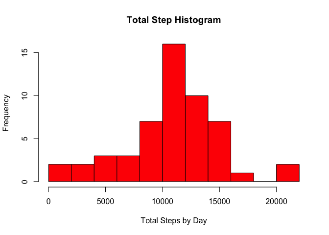

# Reproducible Research: Peer Assessment 1
This program is for the peer assignment of Reproducubile Research Assessment 1  
The exact instructions are in the GitHub in the doc direction, in a  
file instructions.pdf  

**Note on downloading the initial dataset: **   
As per the instructions, it is assumed that the file has already been downloaded  
and in the working directory.   If, though the file would need to be downloaded 
again the url is:  
https://d396qusza40orc.cloudfront.net/repdata%2Fdata%2Factivity.zip 

As per the instructions:  
The variables included in this dataset are:  

* steps: Number of steps taking in a 5-minute interval (missing values are coded as NA)  
* date: The date on which the measurement was taken in YYYY-MM-DD format  
* interval: Identifier for the 5-minute interval in which measurement was taken  

The dataset is stored in a comma-separated-value (CSV) file and there are a total  
of 17,568 observations in this dataset.  

## Loading and preprocessing the data
1. Unzip the file  
2. Read the CSV  
3. Format the Date  


```r
unzip("activity.zip");
rawData<-read.csv("activity.csv");
rawData$date <- as.Date(rawData$date, "%Y-%m-%d");
```

Now check the data looks correct  

```r
head(rawData);
```

```
##   steps       date interval
## 1    NA 2012-10-01        0
## 2    NA 2012-10-01        5
## 3    NA 2012-10-01       10
## 4    NA 2012-10-01       15
## 5    NA 2012-10-01       20
## 6    NA 2012-10-01       25
```


## What is mean total number of steps taken per day?
1. Aggregate the steps by date  
2. Create a histogram based on this aggregated data 
3. Calculate the median and mean  


```r
stepsTotal <- tapply(rawData$steps, rawData$date, sum);
hist(stepsTotal,  breaks=15, xlab = "Total Steps by Day", ylab = "Frequency", 
     main = "Total Step Histogram", col="red");
```

 
  
Calculate the mean removing the NA's  

```r
stepMean<-mean(stepsTotal,na.rm=TRUE);
stepMean;
```

```
## [1] 10766.19
```

Calculate the median removing the NA's  

```r
stepMedian<-median(stepsTotal,na.rm=TRUE);
stepMedian;
```

```
## [1] 10765
```

## What is the average daily activity pattern?


## Imputing missing values


## Are there differences in activity patterns between weekdays and weekends?
